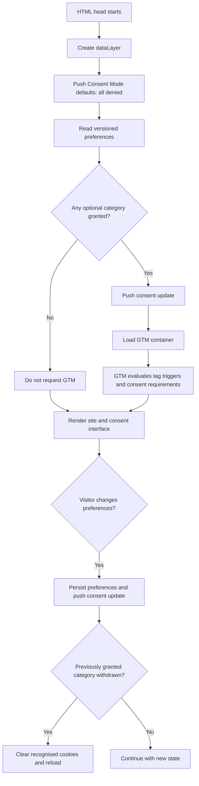

# Privacy, analytics, and legal implementation playbook

This playbook documents the consent, Google Tag Manager, Google Analytics 4, Google Consent Mode v2,
and legal-page pattern implemented for Eloquent. It is written for humans and coding agents who need
to maintain this repository or reproduce the pattern on another Eloquent or client website.

The playbook describes an implementation pattern. Legal text, retention periods, providers, and
measurement purposes must be confirmed for every organisation and jurisdiction. Never copy
Eloquent's company details into another website.

## 1. Read this first

Use these documents together:

| Document                              | Purpose                                                                                          |
| ------------------------------------- | ------------------------------------------------------------------------------------------------ |
| `PRIVACY_ANALYTICS_LEGAL_PLAYBOOK.md` | Reusable architecture, implementation sequence, legal inputs, test matrix, and maintenance rules |
| `ANALYTICS.md`                        | Current Eloquent identifiers, enabled products, GA4 settings, and site-specific verification     |
| `DATA_RETENTION.md`                   | Eloquent's approved email-retention periods and Google Workspace Business Standard process       |
| `PAGE_LAYOUTS.md`                     | DOM and responsive contract for Eloquent's legal pages                                           |
| `DESIGN_SYSTEM.md`                    | Tokens, shared-component ownership, controls, focus, and responsive rules                        |
| `AGENTS.md`                           | Mandatory repository workflow and safeguards                                                     |

When adapting this pattern, create a site-specific analytics document and retention document. Keep
this playbook generic.

## 2. Intended outcome

A correct implementation has these properties:

- No optional Google request occurs before the visitor makes a choice.
- Necessary storage is limited to remembering consent preferences.
- Analytics and advertising can be accepted or rejected independently.
- Accept-all and reject-all controls are available at the same interaction level and with comparable
  prominence.
- Consent defaults are set before GTM can load.
- GTM loads only after at least one optional category is accepted.
- Every tag inside GTM respects the matching consent type.
- Visitors can reopen their preferences from every page.
- Withdrawing consent stops future optional processing, clears recognised first-party cookies, and
  reloads the page when needed.
- Primary content and navigation remain available without JavaScript.
- Privacy, cookie, and legal notices describe the actual organisation, providers, configuration, and
  retention rules.
- The implementation is tested in all meaningful consent states before release.

This is a **basic Consent Mode** pattern: Google scripts are not requested before consent. It does
not send cookieless Google pings before a choice.

## 3. Architecture



### Responsibilities

| Layer               | Owns                                                                                                      |
| ------------------- | --------------------------------------------------------------------------------------------------------- |
| Website application | Default consent, preference storage, banner UI, GTM loading gate, withdrawal, persistent settings control |
| Google Tag Manager  | Published tag inventory, triggers, variables, per-tag consent requirements, version history               |
| Google Analytics 4  | Data stream, retention, enhanced measurement, Signals, Ads links, redaction, reporting                    |
| Legal pages         | Controller identity, purposes, legal bases, providers, transfers, retention, rights, cookie inventory     |
| Organisation        | Approval, provider contracts, data-retention operations, rights requests, DPO process, periodic review    |

A tag appearing in GTM does not make its disclosure optional. The published container and the legal
pages must agree.

## 4. Eloquent file map

| File                                     | Responsibility                                                                                                        |
| ---------------------------------------- | --------------------------------------------------------------------------------------------------------------------- |
| `src/layouts/BaseLayout.astro`           | Sets denied defaults in the head, reads preferences, maps them to Consent Mode, and conditionally loads GTM           |
| `src/components/ConsentBanner.astro`     | Renders categories and actions, stores choices, emits changes, clears recognised cookies, and reopens from the footer |
| `src/components/SiteFooter.astro`        | Provides links to all legal pages and the persistent `Gestionar cookies` button                                       |
| `src/styles/global.css`                  | Owns shared consent-interface styling and interaction states                                                          |
| `src/styles/tokens.css`                  | Supplies colors, spacing, typography, borders, shadows, layers, and control sizes                                     |
| `src/layouts/LegalPageLayout.astro`      | Owns the reusable legal-page hero, overview, table of contents, and article slot                                      |
| `src/styles/legal-page.css`              | Owns legal-page composition, prose, tables, and responsive behavior                                                   |
| `src/pages/aviso-legal.astro`            | Identifies the site owner and defines website terms                                                                   |
| `src/pages/politica-de-privacidad.astro` | Describes personal-data processing                                                                                    |
| `src/pages/politica-de-cookies.astro`    | Describes storage, cookies, categories, providers, and withdrawal                                                     |

Do not duplicate the GTM loader or consent component in individual pages.

## 5. Consent data contract

### Storage key

```text
eloquent:consent-preferences
```

### Current value

```json
{
  "version": 2,
  "analytics": true,
  "marketing": false
}
```

Rules:

- `version` is mandatory. Increase it when the meaning or structure of consent changes materially.
- Missing, invalid, or unknown values resolve to all optional categories denied.
- Booleans must be checked strictly with `=== true`; do not rely on truthy strings.
- Local storage records the preference. It is not evidence of identity and must not include personal
  data.
- The legacy key `eloquent:analytics-consent` is read only for migration. A legacy acceptance becomes
  analytics `true` and marketing `false`.
- The legacy key is removed after the visitor saves the new preference format.

For a new site, choose a site-specific key such as `client-name:consent-preferences`. Keep the schema
versioned.

## 6. Category-to-Consent-Mode mapping

| Website category | Consent Mode state                                                              |
| ---------------- | ------------------------------------------------------------------------------- |
| Necessary        | No optional Google state is granted; local preference storage remains available |
| Analytics        | `analytics_storage`                                                             |
| Advertising      | `ad_storage`, `ad_user_data`, `ad_personalization`                              |

Default state:

```js
gtag('consent', 'default', {
  ad_storage: 'denied',
  ad_user_data: 'denied',
  ad_personalization: 'denied',
  analytics_storage: 'denied',
});
```

Update rules:

```js
gtag('consent', 'update', {
  analytics_storage: analytics ? 'granted' : 'denied',
  ad_storage: marketing ? 'granted' : 'denied',
  ad_user_data: marketing ? 'granted' : 'denied',
  ad_personalization: marketing ? 'granted' : 'denied',
});
```

Do not collapse advertising into analytics. A visitor must be able to allow audience measurement
without agreeing to advertising purposes.

If a future site adds other optional technologies, define a new visible category only after mapping
its technologies, purposes, cookies, retention, vendors, and withdrawal behavior.

## 7. Runtime sequence

### 7.1 Head bootstrap

The consent bootstrap must run as high in the document head as the framework safely allows and before
GTM or any Google tag.

Sequence:

1. Create `window.dataLayer`.
2. Define the `gtag` queue helper.
3. Push all-denied consent defaults.
4. Read and validate stored preferences.
5. Push the corresponding consent update.
6. Load `gtm.js` only if analytics or advertising is granted.
7. Listen for the website's consent-change event.

In Eloquent, the event is:

```text
eloquent:consent-change
```

Its `detail` is the full preference object. Reusable implementations should use a clearly namespaced
event.

### 7.2 Why the GTM `noscript` iframe is omitted

The standard iframe would contact Google immediately after the opening `body` tag. That contradicts
this implementation's guarantee that no optional Google request occurs before consent. Do not add it
unless the organisation intentionally adopts a different consent architecture and updates its legal
and technical review.

### 7.3 Banner behavior

The interface appears when no valid preference exists. It includes:

- a concise explanation;
- a link to the cookie policy;
- an analytics checkbox;
- an advertising checkbox;
- `Aceptar todas`;
- `Rechazar opcionales`;
- `Guardar preferencias`.

The footer control reopens the same interface with the current values. Pages must not create their own
cookie settings modal.

Accessibility contract:

- Use a labelled dialog region.
- Associate explanatory text with `aria-describedby`.
- Group categories in a `fieldset` with a legend.
- Use native checkboxes and buttons.
- Preserve visible focus.
- Move focus into the interface when it is reopened.
- Keep labels large enough for touch input.
- Test all actions with a keyboard.

### 7.4 Saving and withdrawal

On save:

1. Write the complete versioned preference object.
2. Remove the legacy key.
3. Dispatch the consent-change event.
4. Hide the interface.
5. Clear recognised first-party cookies for denied categories.
6. Reload if a previously granted category has been withdrawn.

Eloquent recognises:

| Category    | First-party cookie prefixes |
| ----------- | --------------------------- |
| Analytics   | `_ga`                       |
| Advertising | `_gcl`, `_gac`, `FPAU`      |

A website cannot reliably delete third-party cookies created on Google or DoubleClick domains. The
cookie policy must tell visitors that browser controls may be required.

Cookie names change. Review the real browser inventory and Google documentation before every launch
and whenever GTM changes.

## 8. Google Tag Manager configuration

### 8.1 Create and install the container

1. Create the organisation's own GTM account and web container.
2. Record the container ID in the site-specific analytics document.
3. Put the ID in one shared configuration location or environment variable where possible.
4. Install only the consent-controlled loader. Do not also paste a normal GTM snippet or GA script.
5. Keep the container owned by the client or site owner, with Eloquent receiving the minimum access
   required to maintain it.

### 8.2 Consent configuration

For every tag, document:

- tag name and type;
- purpose;
- trigger;
- data sent;
- required consent types;
- legal-page disclosure;
- owner and approval date.

Google tags have built-in consent behavior. Review the tag's consent checks in GTM. Non-Google tags
must receive explicit additional consent requirements matching the visible category. Never rely only
on the website banner text.

Minimum expected mapping:

| Tag                                  | Trigger                        | Consent requirement                              |
| ------------------------------------ | ------------------------------ | ------------------------------------------------ |
| Google tag / GA4                     | All pages after GTM loads      | `analytics_storage`                              |
| Google Ads conversion or remarketing | Approved event or page trigger | Advertising consent types required by the tag    |
| Functional third party               | Approved functional trigger    | Its documented category; create one if necessary |

### 8.3 Publishing discipline

1. Use GTM Preview and Tag Assistant.
2. Test all consent states in the matrix below.
3. Name the container version clearly, for example `Consent v2 – analytics and advertising`.
4. Add a description of tags added, changed, or removed.
5. Publish only after legal text and cookie inventory match the previewed container.
6. Record the version, date, approver, and major settings in the site-specific analytics document.

A workspace change is not live until the container version is published.

## 9. Google Analytics 4 configuration

### 9.1 Property and web stream

1. Create the property in the site owner's Google account.
2. Set the correct reporting time zone and currency.
3. Create one web stream for the canonical production domain.
4. Record the measurement ID and stream ID.
5. Add the Google tag through GTM; do not duplicate it in application code.
6. Exclude known internal or developer traffic only with an approved, documented method.

### 9.2 Enhanced measurement

Enable only events that correspond to actual website features.

Recommended baseline for an editorial or professional-services website:

| Measurement       | Default recommendation                                 |
| ----------------- | ------------------------------------------------------ |
| Page views        | On                                                     |
| Scrolls           | On for long editorial pages                            |
| Outbound clicks   | On                                                     |
| File downloads    | On if downloadable files exist or are planned          |
| Site search       | Off unless the website has search                      |
| Video engagement  | Off unless supported embedded videos exist             |
| Form interactions | Off unless forms exist and their data flow is reviewed |

Review this configuration whenever a new search, form, video, booking, or download feature is added.
Never send names, email addresses, phone numbers, or other directly identifying data in URLs, event
parameters, user IDs, or custom dimensions.

### 9.3 Retention and advertising settings

Decide and document:

- event and user-data retention;
- reset-on-new-activity setting;
- Google Signals;
- granular location and device collection;
- user-provided data collection;
- Google Ads links and personalized advertising;
- Search Console links;
- email and URL-query redaction.

Do not enable a feature merely because it is available. It needs a purpose, matching consent,
disclosure, retention decision, and owner approval.

### 9.4 Advertising

If Google Ads, Signals, remarketing, conversion measurement, or audience sharing is enabled:

- show a separate advertising category;
- map it to all relevant Consent Mode advertising states;
- disclose the purpose and Google relationship in privacy and cookie policies;
- list the possible advertising cookies based on the real tag inventory;
- verify Ads-link personalization and audience settings;
- keep automatic collection of user-provided data disabled unless specifically designed and approved.

## 10. Legal-page system

### 10.1 Required routes

The Eloquent pattern uses:

```text
/aviso-legal/
/politica-de-privacidad/
/politica-de-cookies/
```

All routes must be linked from every page footer. `Gestionar cookies` must be a button that reopens
preferences, not a link to the cookie policy.

### 10.2 Shared DOM contract

```text
LegalPageLayout
├── PageHero
│   ├── eyebrow
│   ├── h1
│   ├── introduction
│   └── visible update date
├── optional overview
│   └── summary definition list
└── legal content section
    └── container
        ├── table-of-contents aside
        │   └── nav with in-page links
        └── article
            └── headed legal sections
```

Requirements:

- one `h1`;
- logical `h2` section hierarchy;
- visible last-updated date;
- stable heading IDs and matching table-of-contents links;
- readable prose width;
- ordinary, descriptive links;
- horizontally scrollable tables that are keyboard focusable;
- no hidden legal text or consent information;
- responsive reading order with the table of contents before the article.

### 10.3 Information to collect from every client

Do not draft final legal pages until the following worksheet is completed.

#### Organisation

- Full legal name.
- Trading name used by the website.
- NIF/CIF/VAT number.
- Registered or fiscal address.
- Direct contact email.
- Public-register name, volume, page, sheet, or registration number **when applicable**.
- Administrative authorisations when the activity is regulated.
- Professional body and membership information when a regulated profession is involved.
- Whether prices, online contracting, payments, subscriptions, or consumer services appear on the
  site.

A tax identifier does not prove public-register registration. Never invent registry data. Spanish
LSSI registry details are included only when an applicable registration exists.

#### Data protection

- Controller and, if different, site owner.
- DPO or privacy contact and confirmation of any required notification.
- Every data source: forms, email, accounts, bookings, checkout, uploads, chat, analytics, advertising.
- Purpose and legal basis for each processing activity.
- Data categories and affected people.
- Processors and sub-processors.
- International-transfer mechanisms.
- Retention period or documented criterion for every record class.
- Rights-request process.
- Supervisory authority.
- Automated decisions or profiling, if any.

#### Technology and vendors

- Hosting provider and current contract/DPA.
- Email provider and plan.
- CDN, DNS, security, booking, CRM, forms, newsletters, chat, video, maps, fonts, payments, embeds,
  analytics, advertising, and CAPTCHA providers.
- Production cookie and local-storage inventory.
- GTM published tag inventory.
- GA4 property settings and product links.

### 10.4 Aviso legal content

At minimum, confirm:

- site owner identity and contact;
- applicable registration or authorisation details;
- purpose and conditions of use;
- intellectual and industrial property;
- rules for external links;
- availability and proportionate responsibility wording;
- governing law and mandatory consumer jurisdictions;
- links to privacy and cookie policies.

Do not use absolute disclaimers that attempt to exclude mandatory liability or consumer rights.

### 10.5 Privacy-policy content

Describe the real processing operations:

- controller and DPO/privacy contact;
- data collected directly and automatically;
- technical server logs;
- analytics and advertising as separate purposes;
- legal bases;
- processors, product links, and international transfers;
- approved retention periods;
- rights and how to exercise them;
- supervisory authority;
- automated decision-making, if any.

Provider claims must come from the current contract, DPA, admin configuration, or authoritative
provider documentation. If an exact infrastructure retention period cannot be established, document
the verified criterion without inventing a number.

### 10.6 Cookie-policy content

Include:

- explanation of cookies and local storage;
- necessary, analytics, and advertising categories actually used;
- table of names or patterns, providers, purposes, durations, and types;
- GTM container and analytics measurement relationship;
- clear explanation of accept, reject, customize, reopen, and withdraw actions;
- first-party and third-party deletion limitations;
- links to relevant provider privacy and cookie information;
- visible last-updated date.

The policy must use conditional language for cookies that depend on browser, location, or tag
configuration. Do not list a cookie merely because it is common; confirm it in the implementation or
provider documentation.

## 11. Reusing the pattern on another site

### Recommended configuration boundary

For future projects, keep site-specific values in one typed configuration module. Components should consume this object instead of repeating identifiers, routes, category names or storage keys.

```ts
export const privacyConfig = {
  storageKey: 'client:consent-preferences',
  schemaVersion: 1,
  gtmContainerId: 'GTM-XXXXXXX',
  categories: {
    necessary: { required: true },
    analytics: { required: false },
    marketing: { required: false },
  },
  legalRoutes: {
    notice: '/aviso-legal/',
    privacy: '/politica-de-privacidad/',
    cookies: '/politica-de-cookies/',
  },
} as const;
```

The public GTM and GA4 identifiers may live in source control. API secrets, account credentials and private legal records must not. Eloquent's current implementation predates this configuration module and keeps the equivalent constants in `BaseLayout.astro` and `ConsentBanner.astro`; consolidate them before copying the implementation into a new project.

### Phase 1: discovery

1. Complete the client worksheet above.
2. Export the current GTM tag, trigger, and variable inventory.
3. Inspect the browser's cookies, local storage, network requests, and embedded providers.
4. Record GA4, Ads, Search Console, Signals, redaction, retention, and enhanced-measurement settings.
5. Confirm who owns each account and who may publish changes.
6. Decide categories before writing the banner.

### Phase 2: implementation

1. Add a shared consent bootstrap to the global head.
2. Add one shared preference component.
3. Add a persistent footer settings control.
4. Use a versioned, site-specific storage key.
5. Map each visible category to technical consent states.
6. Gate GTM behind at least one accepted optional category.
7. Configure every GTM tag's consent checks.
8. Build the three legal routes from verified inputs.
9. Add legal routes to sitemap and navigation when they are indexable.
10. Keep primary site content functional without JavaScript.

### Phase 3: migration

When replacing an existing consent system:

- inventory old storage keys and cookies;
- choose whether old acceptance can be safely mapped to the new categories;
- never infer advertising consent from a generic or analytics-only legacy acceptance;
- keep a temporary migration reader;
- remove the old implementation only after verifying that duplicate tags no longer load;
- document when the migration code can be retired.

### Phase 4: release

1. Update legal text from the final published tag inventory.
2. Run the complete test matrix.
3. Publish GTM with a named version.
4. Deploy the website to staging.
5. Repeat Tag Assistant and network tests on staging.
6. Obtain owner approval for legal copy and production release.
7. Deploy production.
8. Verify the canonical domain from a clean browser.
9. Record the release date, GTM version, approver, and known limitations.

## 12. Verification matrix

Use a fresh browser profile or clear cookies and site storage between scenarios.

| Scenario             | Stored preference                | Expected Google request                     | Expected Consent Mode                              |
| -------------------- | -------------------------------- | ------------------------------------------- | -------------------------------------------------- |
| First visit          | None                             | None                                        | All denied                                         |
| Reject all           | Analytics false, marketing false | None                                        | All denied                                         |
| Analytics only       | Analytics true, marketing false  | GTM and approved analytics tags             | Analytics granted; advertising denied              |
| Advertising only     | Analytics false, marketing true  | GTM and approved advertising tags           | Analytics denied; three advertising states granted |
| Accept all           | Both true                        | GTM and all approved tags                   | All relevant states granted                        |
| Withdraw analytics   | Analytics changes true → false   | Reload; no further analytics tag activity   | Analytics denied                                   |
| Withdraw advertising | Marketing changes true → false   | Reload; no further advertising tag activity | Advertising states denied                          |
| JavaScript disabled  | No runtime preference handling   | None                                        | No optional processing                             |

For every scenario verify:

- network requests;
- `dataLayer` consent commands;
- cookies and local storage;
- Tag Assistant consent state and fired/blocked tags;
- GA4 Realtime and DebugView when analytics is allowed;
- no duplicate page views;
- persistence across navigation and reload;
- keyboard operation and focus;
- mobile and desktop layout;
- no console errors;
- no horizontal page overflow;
- one `h1` and logical legal-page headings.

Example browser checks:

```js
localStorage.getItem('site-name:consent-preferences');
```

```js
window.dataLayer
  .filter((entry) => entry && entry[0] === 'consent')
  .map((entry) => Array.from(entry));
```

Filter network requests for:

```text
googletagmanager.com
google-analytics.com
doubleclick.net
googleadservices.com
```

## 13. Acceptance criteria

Do not approve release until all statements are true:

- [ ] The controller has approved the purposes, categories, providers, and retention periods.
- [ ] The legal identity and applicable registration details are verified or explicitly marked as not applicable.
- [ ] The footer links all legal pages and exposes cookie preferences.
- [ ] All optional consent states default to denied.
- [ ] No optional vendor request occurs before a choice.
- [ ] Reject all is as easy to find and use as accept all.
- [ ] Analytics and advertising can be chosen independently.
- [ ] The GTM published container matches the reviewed workspace.
- [ ] Every tag has a documented purpose, trigger, and consent requirement.
- [ ] No direct identifiers are sent to GA4 or advertising platforms.
- [ ] Legal pages match the actual production tag and cookie inventory.
- [ ] Withdrawal is tested for every optional category.
- [ ] Keyboard, mobile, no-JavaScript, accessibility, and build checks pass.
- [ ] The release record includes the website version and GTM container version.

## 14. Change-management rules

Any of these changes require a consent and legal review:

- adding, removing, or changing a GTM tag;
- enabling a GA4 enhanced-measurement event;
- linking an advertising or audience product;
- enabling Signals, user-provided data, remarketing, or personalization;
- adding forms, booking, payments, accounts, newsletters, chat, embeds, video, maps, or CAPTCHA;
- changing hosting, email, CDN, analytics, advertising, or other processors;
- changing retention periods;
- changing the organisation, address, DPO, contact, or registration details;
- changing the canonical domain;
- changing the consent categories or stored preference schema.

For each change:

1. update code and GTM;
2. update the cookie inventory and privacy purposes;
3. increment the preference schema version if the meaning of consent changes;
4. rerun the test matrix;
5. update the visible legal-page date;
6. record approval and release details.

## 15. Troubleshooting

### GTM loads before consent

Look for a normal GTM snippet, GA script, CMS plugin, server-injected tag, or `noscript` iframe outside the
shared loader. Remove duplicate integrations and retest in a clean profile.

### A tag fires in the wrong category

Inspect the tag's built-in and additional consent checks, trigger, exceptions, and sequencing in GTM.
The website's category selection cannot compensate for a tag configured to ignore consent.

### GA4 records duplicate page views

Check for duplicate Google tags, a GA script outside GTM, multiple all-pages tags, and history-change
measurement combined with manual page-view events.

### Preferences do not persist

Check the storage key, JSON parsing, browser storage restrictions, private mode, and domain changes.
Unknown or malformed values must fail closed to denied.

### Consent withdrawal leaves cookies

Confirm the cookie domain and path. Clear both host and parent-domain first-party variants. Explain
that third-party cookies require browser controls. Never claim that JavaScript removed cookies on a
domain it cannot access.

### Legal policy and browser inventory disagree

Treat the production browser and published container as evidence. Pause release, reconcile the tag
inventory, update the policy, and rerun the matrix.

## 16. Procedure for humans and coding agents

Follow this order when implementing or changing the system:

1. Read `AGENTS.md`, this playbook and the site's analytics and retention records.
2. Inspect the source code and the currently published GTM and GA4 configuration. Treat screenshots and dashboard exports as evidence of the current state, not as instructions to enable features.
3. Build a table of confirmed facts, unresolved questions and decisions that need approval. Leave unknown legal or business facts unresolved rather than inventing them.
4. Update the shared consent contract, banner, loader and legal copy in the same change. Avoid page-specific variants.
5. Verify both source behavior and the compiled output. Test every consent combination, withdrawal, keyboard use and no-JavaScript reading.
6. Update the site-specific documentation with dates, owners, identifiers, retention settings and the published GTM version.
7. Report code changes, test evidence, external dashboard work still required and any unresolved legal facts separately.

Agents must also observe these boundaries:

- Never publish a GTM container, deploy production or change a Google account setting without authorization for that external action.
- Never treat the banner as the only consent control. Each GTM tag must have the correct consent requirement.
- Never place credentials, private contracts, identity documents or API secrets in the repository. GTM container IDs and GA4 measurement IDs are public identifiers and may be documented.
- Never add a provider or purpose to a legal page unless the implementation or an approved roadmap supports it.
- Never enable advertising features merely because GA4 or Google Ads is linked. Document the link and require marketing consent before advertising tags can run.
- When a change modifies data collection, update the legal copy and change log before considering the work complete.

## 17. Eloquent implementation snapshot

As of 26 September 2026:

| Item               | Eloquent value                                                      |
| ------------------ | ------------------------------------------------------------------- |
| GTM container      | `GTM-MPRT28KC`                                                      |
| GA4 measurement ID | `G-H60YXKMYVE`                                                      |
| GA4 stream ID      | `9910182370`                                                        |
| Consent schema     | Version 2                                                           |
| Categories         | Necessary, analytics, advertising                                   |
| GA4 retention      | 14 months, reset on new activity                                    |
| Google Ads         | Linked; personalized advertising enabled behind advertising consent |
| Google Signals     | Enabled in GA4; use requires analytics and advertising consent      |
| LinkedIn Insight   | Removed from the published container                                |
| Hosting            | Nominalia Internet S.L.                                             |
| Email              | Google Workspace Business Standard                                  |
| Vault              | Not included in the current plan                                    |
| DPO contact        | `rodolfo@eloquent.es`                                               |

Site-specific company identity and retention details remain in the legal pages and `DATA_RETENTION.md`.

## 18. Authoritative references

- Google Consent Mode reference:
  <https://support.google.com/tagmanager/answer/13802165>
- Google enhanced measurement:
  <https://support.google.com/analytics/answer/9216061>
- Google advertising cookies:
  <https://policies.google.com/technologies/cookies>
- Google Workspace data-processing addendum:
  <https://cloud.google.com/terms/data-processing-addendum/>
- Google Workspace Business editions:
  <https://knowledge.workspace.google.com/admin/getting-started/editions/business-editions>
- Spanish AEPD cookie guide:
  <https://www.aepd.es/guias/guia-cookies.pdf>
- Spanish LSSI, including Articles 10 and 22:
  <https://www.boe.es/buscar/act.php?id=BOE-A-2002-13758>
- GDPR consolidated text:
  <https://eur-lex.europa.eu/eli/reg/2016/679/oj>
- Nominalia privacy information:
  <https://www.nominalia.com/quienes-somos/condiciones-legales/cookies/>
- Nominalia data-processing agreement:
  <https://www.nominalia.com/wp-content/uploads/2019_contrato_tratamiento_datos_personales.pdf>
